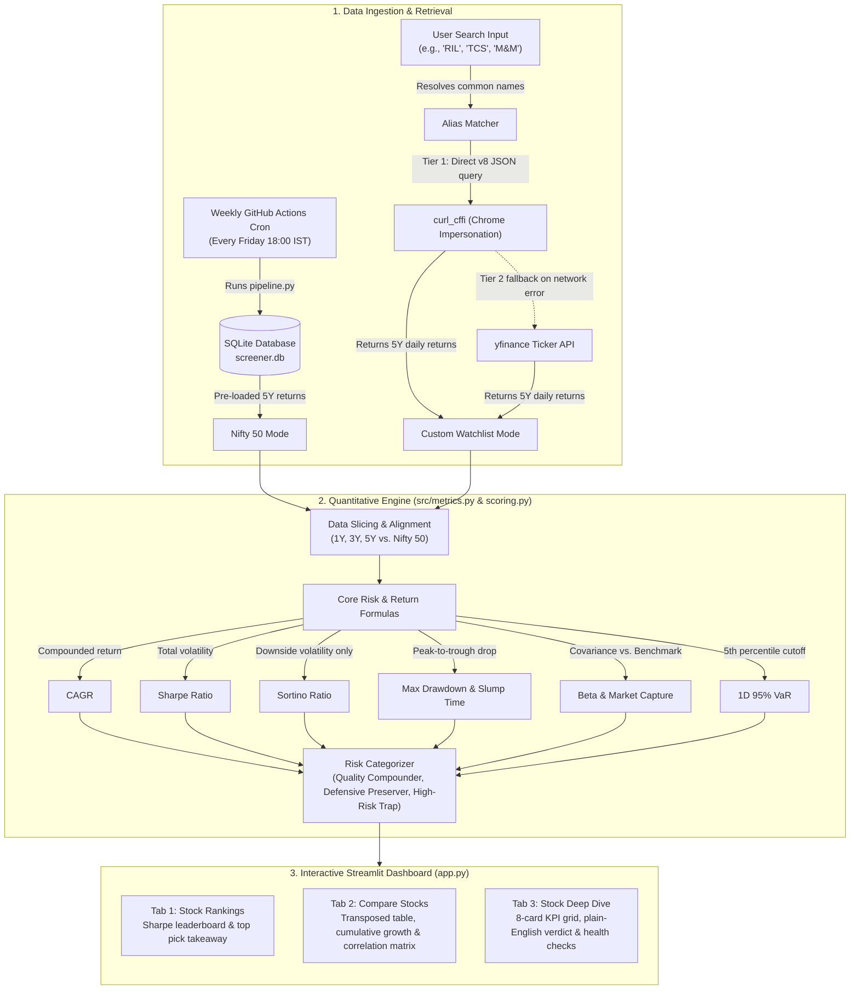
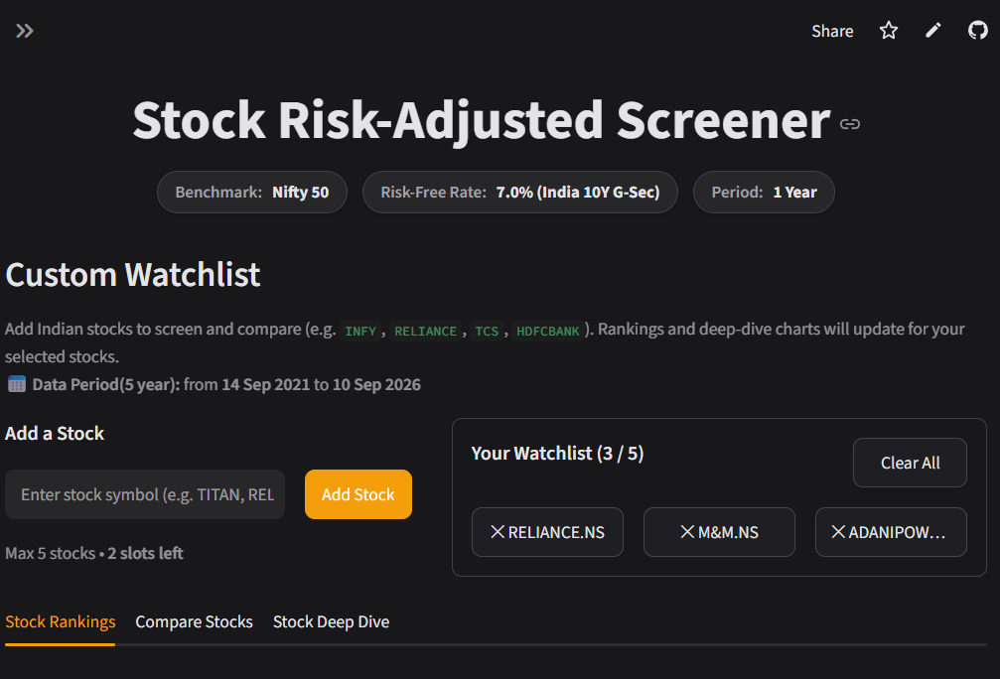
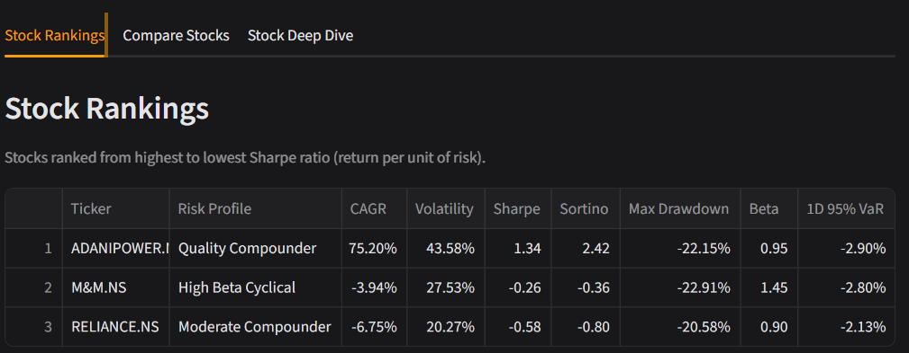
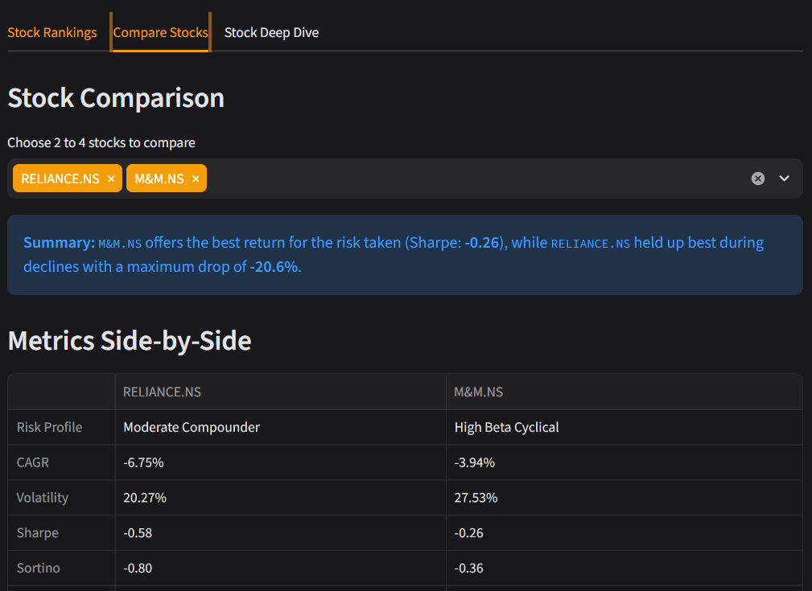
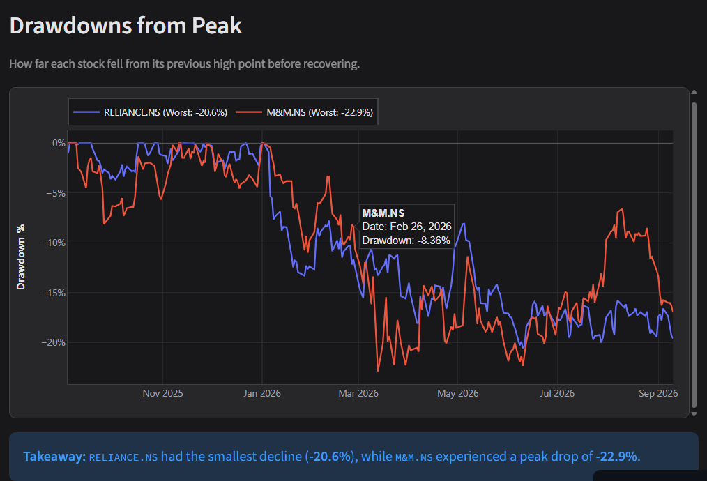
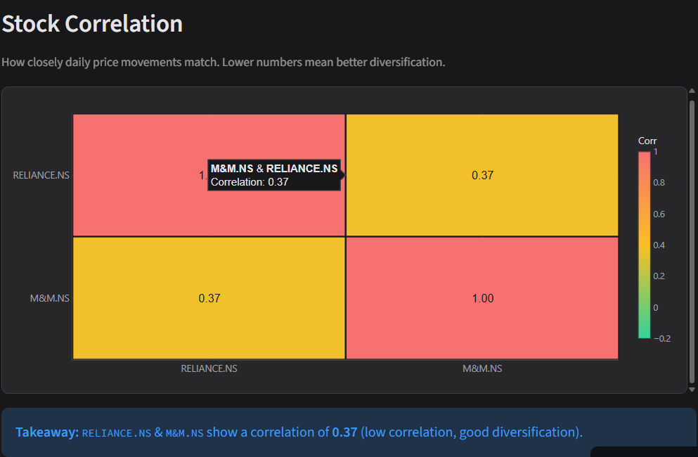
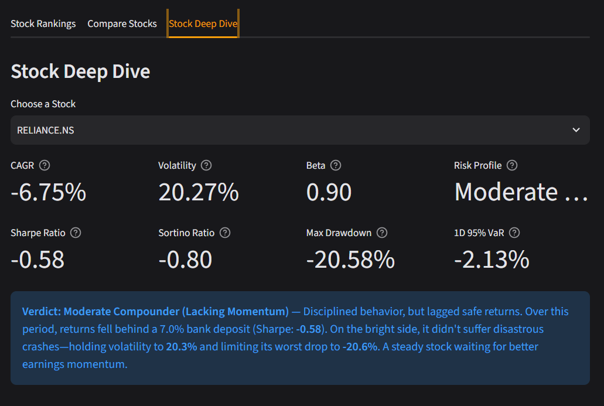
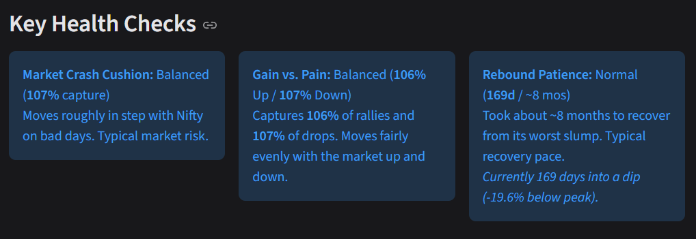
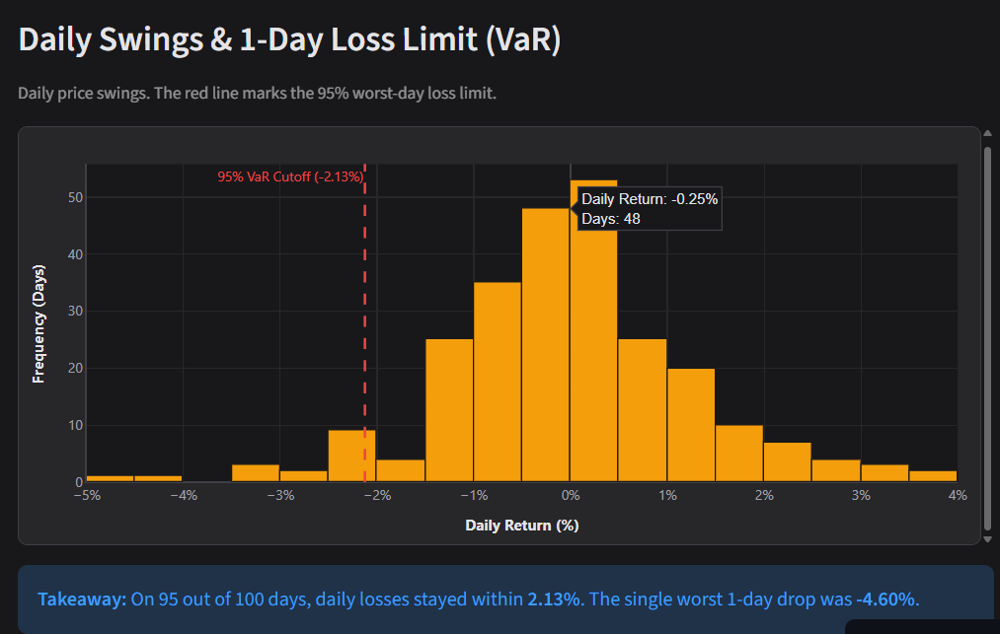

# Risk-Adjusted Stock Screener (Indian Equities)

 **Live Demo:** [[Open App on Streamlit]](https://stock-risk-adjusted-screener.streamlit.app/)

An interactive stock analysis dashboard that helps you evaluate whether a stock's returns are actually worth the risk you take.

Most free screeners show raw past returns (like *"this stock gave 40% in a year"*), but they don't show how much price volatility or drawdown you had to sit through. This project pulls 5 years of daily price data and ranks Indian equities using portfolio-level metrics like Sharpe Ratio, Sortino Ratio, Maximum Drawdown, and Beta.

--

##  Why I Built This

When retail investors look for stocks, they usually chase whatever went up the most recently. But two stocks with the same 20% annual return can have very different risk:
- One grows steadily with small 5–10% dips.
- The other crashes 35–40% before bouncing back, testing an investor's patience and leading to panic selling.

I built this screener to bring risk-adjusted evaluation into simple, practical terms for retail investors.

--

## What the App Does

### 1. Pre-Loaded Universe + Live Custom Search
- **Nifty 50 Universe:** Comes pre-loaded with 5 years of daily data for 20 large-cap stocks across 7 sectors (IT, Banking, Auto, Energy, Pharma, FMCG, Materials), stored locally in SQLite for fast startup (**updates weekly**).
- **Search Any NSE Stock:** You can switch to "Custom Watchlist" and type any Indian stock symbol or name (e.g. `RIL`, `TCS`, `M&M`, `BAJAJ FINANCE`). A built-in alias resolver maps common name to their Yahoo Finance symbols and loads 5 years of daily returns in ~1.5 seconds.

### 2. Three Main Tabs
- **Tab 1: Screener & Rankings** — Displays a scorecard ranking stocks from best to worst by Sharpe Ratio. Filter by risk categories, set minimum CAGR thresholds, and export results to CSV.
- **Tab 2: Compare Stocks** — Pick 2 to 4 stocks and compare them side by side with:
  - Cumulative return growth chart
  - Drawdown curves from previous peaks
  - Correlation heatmap to check if your selected stocks actually provide diversification
- **Tab 3: Stock Deep Dive** — Inspect a single stock in detail:
  - 8-metric scorecard (CAGR, Volatility, Beta, Sharpe, Sortino, Max Drawdown, 1D 95% VaR, Risk Profile)
  - Plain-English verdict summarizing whether the stock's returns justified its risk
  - Market crash cushion (Downside Capture vs. Nifty 50 on red days)
  - Slump recovery time (how many days/months it took to recover from its worst drop)
  - 95% Historical Value-at-Risk (VaR) distribution

--

## How It Works (End-to-End Workflow)

The flowchart below outlines how market data flows from offline and live sources through our quantitative risk engine into the user dashboard:



---

## Metrics Explained Simply

| Metric | Formula | Practical Meaning & Why It Matters |
| :--- | :--- | :--- |
| **CAGR** | $ (\frac{\text{Ending Value}}{\text{Starting Value}})^{\frac{1}{\text{Years}}} - 1 $ | Smoothes out year-to-year price swings into a single constant annual growth rate. Unlike simple average return, CAGR accounts for compounding, telling you what the investment actually delivered per year in your pocket. |
| **Annualized Volatility** | $ \sigma_{\text{daily}} \times \sqrt{252} $ | Measures how wildly daily prices fluctuate around their average. Higher volatility means a bumpier ride and greater risk of panic-selling during sharp market pullbacks. |
| **Sharpe Ratio** | $ \frac{R_{\text{annual}} - R_f}{\sigma_{\text{annual}}} $ | Measures return earned above a safe 7.05% bank deposit (10Y G-Sec) per unit of total risk. Above 1.0 means you were well-rewarded for the ride; below 0 means you took stock market risk and still earned less than a safe fixed deposit. |
| **Sortino Ratio** | $ \frac{R_{\text{annual}} - R_f}{\sigma_{\text{downside}}} $ | A smarter take on Sharpe that only counts downside drops in the denominator. Standard deviation penalizes both crashes and 20% upside rallies; Sortino only penalizes harmful drops while rewarding upside momentum. |
| **Max Drawdown** | $ \min_t \left(\frac{\text{Price}_t - \text{Peak}_t}{\text{Peak}_t}\right) $ | The deepest percentage drop from an all-time peak to trough before recovering. Reflects real-world investor pain: if you invested at the worst possible peak, this is the worst paper loss you would have had to sit through. |
| **Beta** | $ \frac{\text{Cov}(R_{\text{stock}}, R_{\text{market}})}{\text{Var}(R_{\text{market}})} $ | Gauges sensitivity to the Nifty 50. A Beta of 1.3 means the stock typically moves 30% faster than the market (bigger rally gains, but steeper drops), while a Beta below 0.8 acts as a defensive cushion during market sell-offs. |
| **1D 95% VaR** | $ -\text{Percentile}_{5\%}(R_{\text{daily}}) $ | The maximum single-day loss expected on 95 out of 100 trading days. Helps you set realistic daily risk boundaries so you can differentiate normal market noise from an extreme 1-in-20-day drop. |
| **Downside Capture** | $ \frac{\text{Mean}(R_{\text{stock}} \mid R_{\text{market}} < 0)}{\text{Mean}(R_{\text{market}} \mid R_{\text{market}} < 0)} $ | Shows how much of the Nifty's decline the stock absorbs when the market falls. Below 100% means the stock protects your capital on red days; above 100% means it falls harder than the market during sell-offs. |

---

## Tech Stack

- **Frontend:** Streamlit
- **Visualizations:** Plotly (interactive charts with clean tooltips)
- **Data & Math:** Pandas, NumPy
- **Data Retrieval:** yfinance, curl_cffi (fast API queries with browser impersonation)
- **Database:** SQLite3 (stores pre-computed daily returns)
- **Package Management:** uv / pip

--

## Project Structure

```text
Stock_Risk_Adjusted_Screener/

├── app.py                      # Main Streamlit application
├── pyproject.toml              # Project dependencies and config
├── requirements.txt            # Clean pip requirements for deployment
├── .gitignore                  # Git ignore rules
│
├── .devcontainer/
│   └── devcontainer.json       # VS Code Dev Container configuration
│
├── .github/
│   └── workflows/
│       └── daily_sync.yml      # GitHub Actions weekly automated data sync
│
├── .streamlit/
│   └── config.toml             # App theme and layout configuration
│
├── config/
│   ├── __init__.py
│   └── settings.py             # Global constants (risk-free rate, trading days)
│
├── data/
│   └── screener.db             # SQLite database storing historical returns
│
├── screenshots/                # Application UI screenshots & demo assets
│
├── src/
│   ├── __init__.py
│   ├── fetcher.py              # Live stock fetcher with ticker alias resolution
│   ├── metrics.py              # Quantitative formulas (CAGR, Sharpe, Sortino, VaR, etc.)
│   ├── scoring.py              # Scorecard builder, categorizer, and table formatting
│   ├── charts.py               # Plotly dark-themed interactive chart builders
│   └── pipeline.py             # ETL script to refresh local database
│
└── tests/
    ├── test_live_precision.py  # Math precision unit tests
    └── test_tabs_integration.py# End-to-end integration tests
```

--

## Running Locally

### 1. Clone the repository
```bash
git clone https://github.com/krishna-kuila/Stock-risk-adjusted-screener.git

cd Stock-risk-adjusted-screener
```

### 2. Set up virtual environment & install dependencies
```bash
python -m venv .venv

# On Windows:
.venv\Scripts\activate
# On macOS / Linux:
source .venv/bin/activate

pip install -r requirements.txt

0r 

uv sync
```

*(Alternatively, if you use `uv`: `uv run streamlit run app.py`)*

### 3. Run the application
```bash
streamlit run app.py
```

--

## Testing

The repository includes **17 automated tests** verifying both the financial calculations and the UI integration:

```bash
python -m unittest discover tests -v
```

- **Unit tests:** Check CAGR, Volatility, Sharpe, Sortino, Max Drawdown peak-tracking, and 95% Historical VaR calculations against known test data.
- **Integration tests:** Test data slicing across 1-Year, 3-Year, and 5-Year horizons, single-stock watchlist handling, ticker alias resolution, and invalid ticker handling.

--
## Project Screenshots




